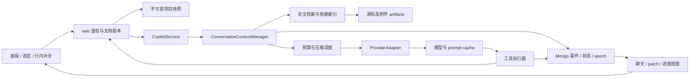

# Copilot 论文上下文组织与压缩设计（终版）

设计日期：2026-09-06。初始审查基线：`3e70e54e5f`。适用范围：Overleaf 的 Copilot 面板对话、选区操作和行内补全。

本文定义完整的交付目标、数据契约、算法、接口及验收条件。实施可按依赖拆分工作，但不能用“先做摘要、以后再补证据/缓存/协作”的版本替代本文目标。本文是设计终稿，不表示运行代码已经实现；参数是明确的默认策略，不是假称已经测得的最优值。

2026-09-06 工作区已有尚未提交的选区/行内补全改动：编辑器操作不加载会话历史、不提供工具、不提取长期记忆，web 也不为其读取全项目正文。本文以这些入口为业务约束；附录的原始代码行号只对应初始审查，不作为当前定位依据。

阅读导航：先看第4节的上下文布局、第7节的压缩流程和第8节的缓存策略；开发按第3节数据模型、第9–12节接口与代码落点实施，第13节作为验收清单。附录保留原始审查证据。

## 1. 最终决策

采用 **持久事件记录 + 可验证论文状态 + 不可变上下文周期（epoch）+ 追加式工作历史 + 按需证据检索**。

核心区别是：数据库中的状态每一步都可以更新，发送给模型的前缀不能每一步跟着重写。同一个 epoch 内，系统规则、工具定义、项目基础资料、检查点和基础证据保持不变；新指令、新证据、文件变更和工具结果追加到末尾。达到压缩或失效边界才生成新 epoch，一次性折叠旧历史。

这同时解决三件事：论文依据可追溯；压缩后能继续工作；相邻请求尽可能共享模型的 KV/prompt cache 前缀。

### 1.1 必须成立的不变量

1. 当前请求原文与仍生效的作者约束不因历史长度被静默删除。超出可执行容量时拆分任务，无法拆分则报告容量不足。
2. 编辑依据来自可验证版本的源文件，`oldText` 不从摘要生成；数值、单位、引用、公式、限定词有原文定位。
3. patch 提交、用户应用、编译成功、内容核验是不同状态，不能互相推定。
4. 保留的工具调用及结果组成完整协议单元；所有业务动作有稳定 ID 和执行记录。
5. 历史事件、规范状态、模型上下文、聊天展示分开保存；prompt 压缩不删除用户聊天。
6. 已压缩的事件不会下一步重新作为原始消息注入；未覆盖的增量不会被摘要游标跳过。
7. 同一 epoch 已发送的内容不可修改、重排、重新序列化；例外通过新 epoch 明确表达。
8. 缓存命中不改变权限、事实版本、上下文容量和验证要求。失效证据不能因缓存便宜而继续作为当前依据。
9. 不保证任意未知模型的缓存命中，也不把估算 token 当作严格计量；未知能力有明确降级行为。

### 1.2 与 coding 的关系及借鉴边界

任务检查点、工具配对、原文定位、文件版本、动作状态都属于通用 agent 机制。论文专门增加 claim—证据关系、作者决策、审稿意见、术语/符号、数值及语气约束。LaTeX 编译修复接近 coding；润色和论文论证不能以“编译通过”验证语义正确。

Claude Code 官方说明会清理旧工具输出、进行摘要并恢复持久规则；其缓存文档描述了用相同 system/tools/history 加末尾摘要指令复用已有前缀的做法。本文借鉴其分层与缓存意识，不假定复制其内部实现。[Claude Code 工作机制](https://code.claude.com/docs/en/how-claude-code-works)、[Claude Code 缓存](https://code.claude.com/docs/en/prompt-caching)

Codex 的官方配置提供自动压缩 token 阈值与压缩提示配置。OpenAI Responses 的独立压缩接口返回新的上下文窗口，其中可包含不可解释的压缩项，后续调用须按该接口契约使用整个返回窗口。本文使用可审计的业务状态作为基础，不把 provider 的压缩项当成论文事实数据库。[Codex 配置](https://learn.chatgpt.com/docs/config-file/config-reference)、[OpenAI Compaction](https://developers.openai.com/api/docs/guides/compaction)

## 2. 组件与数据流



所有组件均在交付范围内：

| 组件 | 职责 | 不承担的职责 |
|---|---|---|
| `ConversationContextManager` | epoch 生命周期、投影、预算、恢复、游标 | 不自行推断 patch 已应用 |
| `ConversationEventStore` | 有序、幂等、可恢复的原始事件 | 不按 20 条截断 |
| `PaperStateReducer` | 从事件归约任务、约束、证据、覆盖进度、验证 | 不把模型文字当作工具成功 |
| `PaperIndexService` | 源码结构、符号/引用关系、词法与语义索引 | 不宣称完整静态解释 TeX |
| `EvidenceResolver` | 按授权和版本取得精确原文，去重和装载 | 不把 artifact ID 当成已提供的原文 |
| `CompactionCoordinator` | 冻结边界、摘要、校验、原子切换 epoch | 不覆盖未处理的并发事件 |
| `ProviderAdapter` | 协议映射、token/usage、缓存断点、请求序列化 | 不对所有 OpenAI-compatible 网关发送相同扩展参数 |
| `ConversationViewProjector` | 完整聊天、稳定 patch ID、状态显示 | 不从压缩摘要伪造用户发言 |

最终持久层采用现有 Mongo，启用 replica set 以使用事务；原文与大结果使用 Mongo GridFS。Redis 只做热点缓存、工作队列和通知，不能作为唯一事实来源。全文及词法候选使用 Mongo 的显式词项倒排记录，语义向量使用独立 Qdrant 服务；服务启动验证所需版本及健康状态。检索服务故障时可退回版本准确的原文读取，但须暴露降级，不能宣称完成缺失的语义审查。

## 3. 持久化模型、版本与权限

### 3.1 作用域

- 私人会话：`tenantId / userId / projectId / conversationId`。所有读取从身份和项目权限推导，不信任客户端自行填写 userId。
- 私人项目记忆：`tenantId / userId / projectId`；全局偏好：`tenantId / userId`，仅放确实跨项目通用的偏好。
- 共享证据：`tenantId / projectId / snapshotId`，只包含授权项目源码及附件派生数据；不包含成员私人聊天。
- `source = panel | selection | inline-completion` 另作执行通道。三个通道不能因复用 conversationId 混入历史。
- Fork、模型切换和项目切换创建新的上下文分支；项目切换不得复用旧项目 epoch。前端会话键包含 projectId。

### 3.2 Mongo collections 与 Redis keys

| 存储 | 关键字段 / 索引 | 保留策略 |
|---|---|---|
| `copilot_conversations` | 唯一 scope；`headSeq, stateRevision, activeEpochId, activeRunId, fencingToken, leaseUntil` | 随会话保存，删除进入清理任务 |
| `copilot_events` | 唯一 `(conversationKey, seq)`；唯一 `(conversationKey, idempotencyKey)`；`eventId, type, runId, payloadRef, occurredAt` | 与会话同生命周期，完整分页读取 |
| `copilot_states` | 唯一 `(conversationKey, revision)`；`appliedThroughSeq, state` | 保留当前版本与所有 epoch 引用版本，其他每日归并 |
| `copilot_epochs` | 唯一 `(conversationKey, epochNo)`；`coveredThroughSeq, prefixRef, prefixHash, orderedBlockRefs, capabilityVersion` | 当前及恢复需要的版本长期保留；非引用投影 30 天清理 |
| `copilot_snapshots` | `projectId, snapshotId, manifestRef, sourceVersionVector, compilerConfig, assetVersions` | 被事件、patch、检查点引用即保留；未引用 7 天清理 |
| `copilot_artifacts` + GridFS | `(projectId, kind, contentHash)` 去重；`size, encoding, mediaType, sourceRefs` | 引用计数为零且超过 7 天清理；不能只依赖 TTL 删除 |
| `copilot_paper_nodes / edges / terms` | snapshot/fileHash、节点 ID、词项 postings、定义/使用及 claim 关系 | 由快照可重建；不覆盖其他版本 |
| `copilot_patch_records` | 唯一 patchId；hunks、baseline、apply receipts、candidate verification | 与会话及项目修改审计关联保存 |
| `copilot_memories` | scope、来源 ID、确认/推断状态、有效性、依赖版本 | 用户可查看/纠正/删除；失效事实不召回 |
| `copilot_request_metrics` | requestId、模型、epoch、prefixHash、usage、成本、延迟、触发原因 | 原始指标 30 天；不含论文正文的日聚合 180 天 |
| Redis `copilot:ctx3:{scopeHash}:head` | 当前 state/epoch 的缓存副本 | 1 小时滑动 TTL；失效回 Mongo |
| Redis `copilot:artifact:{scopeHash}:{hash}` | 原文片段热点副本 | 30 分钟 TTL；重新访问仍验权 |

正文、工具大结果不直接无限嵌入 Mongo 单个文档。单个事件 payload 超过 64 KiB 外置 GridFS；所有历史页面只返回必要正文/链接，避免历史刷新下载整篇论文。

会话默认保存至用户删除或管理员配置的保留期；删除后立即停止检索并作废分支，持久数据清理任务 24 小时内完成，备份另遵循部署保留政策。模型供应商缓存无法被本服务任意清除，不能向用户承诺应用删除会立即擦除供应商 KV。

### 3.3 事件契约

```typescript
interface ConversationEvent {
  eventId: string;
  conversationKey: string;
  seq: number;
  runId: string;
  idempotencyKey: string;
  type:
    | 'user_message' | 'assistant_message'
    | 'tool_started' | 'tool_completed' | 'tool_failed'
    | 'context_delta' | 'file_version_changed'
    | 'patch_proposed' | 'patch_apply_observed'
    | 'verification_completed' | 'constraint_resolved'
    | 'compaction_committed' | 'run_interrupted';
  payloadRef: string;
  occurredAt: string; // 审计字段，不自动渲染进 prompt
}
```

`tool_started` 是执行日志；只有对应完成/失败事件形成模型可回放的 result。一个 assistant 声明多个 tool calls 时，整组工具全部终结后才在模型消息中形成完整组。异步完成按原始 tool-call 顺序回放，不能按网络返回快慢改变前缀。

### 3.4 规范状态与检查点

```typescript
interface PaperState {
  appliedThroughSeq: number;
  activeTask: {
    taskId: string;
    requestEventIds: string[];
    verbatimRequests: string[];
    profile: 'compile' | 'rewrite' | 'audit' | 'review' | 'explain';
    targetNodeIds: string[];
    acceptanceCriteria: SourceBoundRecord[];
  } | null;
  constraints: SourceBoundRecord[];
  authorDecisions: SourceBoundRecord[];
  plan: PlanItem[];
  evidence: EvidenceRecord[];
  coverage: CoverageRecord[];
  patches: PatchState[];
  verifications: VerificationState[];
  unresolved: SourceBoundRecord[];
}
interface SourceBoundRecord {
  id: string;
  value: unknown;
  sourceEventIds: string[];
  sourceArtifactIds: string[];
  basis: 'user_asserted' | 'observed' | 'inferred' | 'unknown';
  validity: 'active' | 'superseded' | 'stale';
  supersedes: string[];
  scope: 'task' | 'section' | 'project' | 'user';
}
interface ContextEpoch {
  epochId: string;
  epochNo: number;
  coveredThroughSeq: number;
  stateAtBoundaryRevision: number;
  protocolProfileId: string;
  immutablePrefixRef: string;
  prefixHash: string;
  baseEvidenceIds: string[];
  appendProjectionRefs: string[];
  projectionThroughSeq: number;
}
```

以上接口里的 `EvidenceRecord` 等类型在对应章节定义字段契约，不是可直接拷贝编译的完整源码。所有对象在实现中使用 JSON Schema 校验，并输出带 schemaVersion 的持久数据。

`PaperState` 是实时业务状态，`ContextEpoch` 是某边界上的冻结模型视图。前者更新不意味着修改后者。新 epoch 的检查点只能包含其 `coveredThroughSeq` 之前的事实；不能拿最新全量状态搭配旧 suffix，否则会重复记录或提前泄漏后面的执行结果。

## 4. 模型上下文的具体组织

### 4.1 六层逻辑结构

Provider 对 tools/system 的内部排列各异，下面是应用的逻辑顺序；适配器以供应商实际渲染顺序计算前缀与断点，不能按 HTTP JSON 属性位置推断 KV 排列。

| 层 | 内容 | 生命周期与变更规则 | 128k 模型下的目标份额示例 |
|---|---|---|---|
| P0 产品协议 | 固定角色规则、来源与状态解释、工具 schemas、输出契约 | 发布版本固定；禁止用户 ID、当前文件、日期、动态工具描述 | 8k |
| P1 项目基础资料 | 项目身份、入口文件、编译配置、精简章节导航、项目约束/术语及已确认偏好 | epoch 创建时冻结；新变化追加 delta，下次 epoch 合并 | 6k |
| P2 工作检查点 | 活跃目标原文、有效约束、作者决策、计划、已验证发现、未完工作与覆盖索引 | 仅在 epoch 边界重建 | 8k |
| P3 基础证据 | 当前编辑片段、关联宏/公式、表格/引用原文；每块有版本和精确范围 | epoch 创建时按任务选取且固定顺序 | 24k |
| P4 历史增量 | 自边界以来的 user/assistant/完整工具组、状态变化、增量证据 | 只追加；历史块发送后不变 | 最高约 18k 的常用保留区 |
| P5 本次新增 | 本轮请求、当前选区/光标、快照变化、刚取得的工具结果 | 追加一次，下一步自然成为 P4 的一部分 | 由剩余预算和输出预留控制 |

表中数值是同一示例的目标分配，不是供应商限制；P5仍须通过第7节的整体预算准入。份额用于装箱顺序而非强行填满：短问题可以只有几千 token。P0–P3 合计超限时移出冷资料、缩小读取窗口或拆分任务，不能塞满整个论文以追求缓存命中。历史已读源码可以留在 P4，没必要再次复制进 P3；升入 P3 只发生在 epoch 切换。

权限可信的产品指令放 system/developer；P1–P3 的项目文本、模型记忆是带来源的上下文数据，使用 user 内容块或协议支持的数据载体，不能把 `.tex` 注释、论文内容和模型推断提升为 developer 指令。真实 user 输入与合成数据在内部有不同类型，聊天视图仅展示真实输入。

### 4.2 可序列化的请求示意

以下是 provider 中立的结构示例，不是任何供应商的完整 API body：

```json
{
  "protocolProfile": "panel-tools-v3",
  "systemRef": "product-policy-v3",
  "toolsetRef": "paper-tools-v3",
  "blocks": [
    {"kind": "project_base", "ref": "base-p1-r8"},
    {"kind": "checkpoint", "ref": "cp-c1-seq120"},
    {"kind": "evidence", "ref": "ev-abstract-h1-lines1-24"},
    {"kind": "evidence", "ref": "ev-results-h2-table3"},
    {"kind": "user_message", "eventId": "e121", "text": "摘要不超过120词，不能改变实验数字"},
    {"kind": "context_delta", "eventId": "e122", "snapshotId": "s9", "currentFile": "abstract.tex"}
  ]
}
```

所有 ref 在发请求前解析成正文；供应商不会替应用读取 GridFS。实际证据块格式固定：

```text
<evidence id="ev42" file="sections/abstract.tex" hash="sha256:..."
 snapshot="s9" lines="1-24" authority="source" freshness="at_snapshot">
<raw_source>这里放未经改写的真实 LaTeX 原文</raw_source>
</evidence>
```

`raw_source` 必须保留原始换行、空格、Unicode 和转义；标签内容需转义或使用长度定界的结构化文本，防止原文中的相同结束标签破坏边界。检索用的规范化文本另存，不能用于 patch。

### 4.3 连续调用如何增长

```text
调用 1: P0 + P1 + P2 + P3 + U1 + D1
调用 2: P0 + P1 + P2 + P3 + U1 + D1 + A1(tool calls) + R1(results)
调用 3: P0 + P1 + P2 + P3 + U1 + D1 + A1 + R1 + A2 + R2
下轮:   上次完整历史 + A_final + U2 + D2
压缩后: P0 + P1 + P2_new + P3_new + 原样保留的近期完整 suffix
```

`D1/D2` 是实际发生变化的环境信息，一次记录并冻结；没有变化就不发。禁止每一步把“最新状态 JSON”插回 P2，也禁止把 currentFile 写进 P0。压缩后的 suffix 即使内容完全未变，也因前面的 P2 改变通常需要重算；它不是可独立拼接的 KV 缓存片段。

### 4.4 三个产品入口

| 入口 | 上下文与缓存策略 | 输出与历史 |
|---|---|---|
| 面板对话 | 完整 P0–P5，epoch 可跨轮复用；普通选择和工具调用不切换工具 schema | 持久会话、工具事件、patch 卡、审计进度 |
| 选区操作 | 独立稳定 `selection/{mode}` 协议；精简项目术语/约束 → 必需周边证据 → 用户要求与精确选区；无整段聊天历史 | 保持现有返回契约；应用后记录修改事实，需要续聊时按显式关联转入面板 |
| 行内补全 | 独立无工具协议；稳定语言/项目约定 → 本章节中不变的前缀（限预算）→ left/right context、光标和 maxLength；动态字符数不进入 system | 最新请求胜出，旧光标请求取消；只记录接受后的编辑事实，不为每次击键抽取记忆 |

行内补全单次输入目标上限 8k token、选区操作 24k，仍受实际模型容量约束。选区超限不裁掉中间正文：可按完整段落拆分且保留公共约束；跨段不可拆的改写转面板作完整任务。行内补全窗口移动会损失尾部缓存，因此窗口按章节/固定锚点滑动，不随每个字符从头重切。不得插入空白填充凑缓存门槛。

## 5. 论文证据、任务画像与检索

### 5.1 节点、边与证据契约

结构节点包含：document、section、paragraph、equation、table、figure、macro、symbol、citation、bib_entry、claim、review_comment。所有节点保存 `projectId, snapshotId, fileHash, sourceRange, parserVersion`；稳定身份基于文档 ID 与结构锚点，无法唯一匹配时创建新节点，不用路径加行号冒充永久 ID。

边包括：`includes / defines / uses / cites / supports / qualifies / contradicts / responds_to`。前四类优先从语法和编译产物获取；后三类由语义分析提出候选并保留原文，未经作者确认不能当作已证明关系。

`EvidenceRecord` 至少含：`evidenceId, artifactId, nodeId, fileHash, snapshotId, exactRange, rawTextHash, sourceEventIds, basis, validity, visibleInEpoch`。图片/PDF 额外记录页码、区域、提取器版本及 OCR 可信标记；重要数字回看原始表格/图片，不仅依赖 OCR。

`CoverageRecord` 至少含：`taskId, snapshotId, fileHash, scope, inspectedRanges, pendingRanges, checkKinds, findings, completeness`。全文审计的“已检查”必须指具体版本和检查种类；读取一个文件不等于已经审查了全部语义。

### 5.2 索引生成

1. 从不可变 snapshot 建立文档树、主文件与 include 关系；解析 bib 数据、定义和使用点。
2. TeX 采用保留源位置的词法/语法解析，明确记录条件编译、未知宏与动态路径；结合允许的编译输出补充实际依赖。解析未完成时不输出“无引用错误”。
3. 按 section/paragraph/equation/table 切块，文本块目标 600–1,200 token；邻接关系外置，不重复存储大量 overlap。超长公式/表格按可定位子单元拆分，保留完整 artifact 引用。
4. 为块生成词项索引和多语言语义向量，按 `(contentHash, indexModelVersion)` 复用计算结果。源码精确字节与索引规范化文本分开。
5. 章节摘要记录研究问题、方法、主要 claim、数字证据、局限和未确认项；新增/变更块增量分析，未变文件不重新摘要。
6. 只有项目授权的正文/附件参与索引；普通引用 key 不触发未经要求的外部文献下载。没有文献全文时明确“仅有书目信息”。

embedding 模型由部署配置，必须支持该实例论文的语言；已有接入凭据不得默认为可向另一服务传输正文。未配置 embedding 的部署以显式降级状态运行词法/结构检索，不伪装具备语义召回。

### 5.3 确定的检索和装箱算法

每轮新任务、新证据需求或文件变更时执行；不是每次模型采样都重新检索排序。

1. 强制候选：用户选区、显式路径/label/cite、待编辑原文、当前编译错误、未解决事实冲突、作者指定禁改内容。
2. 取词法 top 40、语义 top 40、章节标题 top 20，全部先按租户/项目及快照过滤；以 `Σ 1/(60 + rank)` 做排名融合。
3. 展开强制候选的必要依赖：宏定义、符号定义、引用条目、表格及解释段；普通依赖最多两跳、最多 20 个新增节点。截断时记录未展开边，需要全量审计则进入分批覆盖队列，不能报告完整。
4. 合并同版本重叠原文范围，去掉重复块；强制候选先装，剩余按相关性、未解决任务关联及每 token 价值排序。稳定 tie-break 为文档路径、结构顺序、节点 ID。
5. 已在当前 epoch 可见的原文只返回定位说明。新原文追加到尾部，不重新排序 P3。预算不足触发明确的 epoch 切换或继续分批，不以统一占位替换必需原文。
6. 候选相关性不足时调用真实 `search_project`/精确读取；结果保留 query、scope、truncated 和 cursor。“未检索到”不能写成“不存在”。

文件缓存命中只省 I/O；模型前缀命中才可能降低输入计费，两者分别计量。

### 5.4 任务画像决定保留内容

| 画像 | 强保留 | 可压缩/外置 | 验收依据 |
|---|---|---|---|
| 编译修复 | 当前诊断、相关定义、尝试与失败原因、patch 基线 | 重复日志、旧版成功日志 | 对应 snapshot 的编译状态及解析完整性 |
| 润色/翻译/缩写 | 原始要求、目标原文、术语、数字/引用/限定词、语义禁改点 | 不相关章节、过期候选 | 候选字数、精确 token 检查、语义对照与用户接受 |
| 一致性审计 | 检查范围、覆盖清单、术语/符号/指标各出处、未解冲突 | 已核验章节正文 | 全范围覆盖及冲突清单，不单靠一次搜索 |
| 回复审稿 | 意见原文、作者决策、对应修改和证据、逐条状态 | 无关讨论、被明确替代的方案 | 每条意见均有回应与对应依据或未解决说明 |
| 解释/导航 | 目标问题、相关章节与定义、引用依据 | 编辑状态中无关细节 | 回答能定位原文，推断有明确标记 |

画像只决定检索和保留策略，面板工具集不因画像改变，避免每次从“解释”切到“修改”都使最前面的工具缓存失效。画像不能替代当前用户指令。

## 6. 状态归约、工具结果与编辑验证

### 6.1 从事件生成状态

`PaperStateReducer` 按 seq 处理事件，提交 `appliedThroughSeq`，支持同一事件重复消费而不重复计数。

- 用户消息：原文完整保存；解析出候选任务/约束，并校验其原文 span。明确的后续纠正建立 supersedes 关系；不明确则保留冲突。任务解释来自 LLM 时仍为 inferred，不能悄悄扩大授权范围。
- `todo_write`：最后一次成功调用覆盖计划列表；调用失败不覆盖。模型标记 completed 仅代表计划状态，独立的应用/验证状态仍需证据。
- `read_file*`：记录版本和范围；把原文 artifact 加入可见证据目录，不能自动记作该范围已完成全文审计。
- `search_project`：记录检索式、分页和完整性。只在穷尽目标范围后更新相应覆盖状态。
- `submit_patch`：保存不可变 patch、各 hunk、基线和验证报告。工具 dry-run 成功记 proposed；失败记 validation_rejected，不产生可应用卡片。
- 文档操作回执：由 web 服务核对 operation ID、patch/hunk 归属及版本后记录 applied/rejected/conflicted；纯用户文字只记 user_asserted。
- 编译/字数/事实检查：记录各自检查类型、输入 artifact/hash、结果、工具版本和完整性；不同验证结果不可互相替代。

模型自由叙述只进入来源明确的候选发现和说明；不会被程序直接转成“已应用”或“数据正确”。`observed` 表示从源材料观察到，不意味着研究结论已被独立证明。

### 6.2 工具结果的模型视图

工具执行器分离 `fullArtifact` 与 `modelView`，从第一次结果产生时就提供紧凑但充分的 modelView，之后 epoch 内不再修改它。

| 工具 | modelView 必需内容 | 外置内容 |
|---|---|---|
| `read_file*` | 版本、精确原文、范围、完整性、下一段 cursor | 未读正文 |
| `search_project` | 当前页命中及原文短片段、scope、truncated、cursor | 全部命中集合 |
| `todo_write` | 最新计划及状态变更 ID | 被替代计划事件 |
| `submit_patch` | patchId、hunk 数、dry-run 结果、失败原因 | 完整 patch 另存；原 tool-call 参数仍按协议保存 |
| `compile_project` | compileId、snapshotId、状态、错误及截断标记 | 完整日志和构建产物 |
| `count_words` | baseline/candidate/applied、hash、字数、算法版本 | 被统计文本 |
| `inspect_evidence` | 选中证据、依赖、来源与有效性 | 无关命中 |

默认一次 read modelView 不超过 4k token；一次 search 不超过 2k；诊断不超过 2k。超长原文提供完整 artifact 和分页，不能在公式/oldText 中间截断后继续假装完整。每批工具返回总目标不超过 12k token，执行前由调度器分配各工具预算；实际超量在发送前处理。工具 budget 元数据由服务端注入，不写入动态 tool schema。

### 6.3 补丁的完整状态机

```text
generated → validation_rejected
          → proposed → rejected
                     → applied
                     → partially_applied
                     → conflicted
```

每个 hunk 单独保存状态、原始基线 hash、应用后的版本及操作 ID。批次聚合规则：全部 applied 才是 applied；存在 applied 且仍有其他状态为 partially_applied；没有 applied 且发生版本冲突则 conflicted。用户拒绝与服务端验证拒绝区别保存。

`proposed` 不能变成编译成功；验证是另一组记录：

```text
not_run → running → passed | failed | unavailable
                         → stale（对应源码/配置后来发生变化）
```

验证至少区分 `compile / word_count / exact_preservation / semantic_review / citation_support`。语义检查由模型执行时只输出风险和证据，不把一次模型打分当作学术真实性保证。

候选 patch 在服务器内存 overlay 中应用到指定 snapshot，执行字数、引用 key/数值/公式约束检查，再允许提交 proposed；不修改用户项目。`count_words` 支持 `target={kind:'snapshot'|'candidate'|'applied', id}`，结果绑定 hash。前端应用之后重新核对结果版本，不能沿用候选验证冒充实际验证。

## 7. 预算、压缩和持久化切换

### 7.1 预算参数

```text
W = 经过能力配置确认的模型窗口
O = 本次最大输出预留（包含该模型计入输出预算的 reasoning）
S = max(2048, ceil(0.05 × W), 已观测 token 估算正误差的 p99)
B = W - O - S
T = 适配器估算的实际渲染输入（包括缓存命中部分）
G = 下一批工具返回及协议附加内容的预留
```

`B <= 0` 时模型配置不可用；小窗口不能照搬 16k 输出。tool 参数、图像、system、schema、provider 必须回传的推理项均纳入计量。cache 命中不从 T 中扣除。

优先本地准确 tokenizer；支持供应商 token-count API 时在临界处核对。没有匹配 tokenizer 时使用按 UTF-8 bytes 的保守估算并保留额外误差余量，由真实 usage 校准。该估算不是数学保证；未知模型的容量必须由管理员配置，超限反馈走有界恢复，不能声称完全消除了 provider 超限错误。

固定默认调度规则：

- `T + G > 0.85B`：进入压缩准备，禁止再发无界大读取。
- `T > B` 或已收到 context-too-large：硬压缩；主请求未降至预算内不得发送。
- 新 epoch 目标 `T_new <= 0.65B`，并要求至少省出下一批工作空间。若必需内容仍大于目标但小于 B，允许继续小步执行并记录原因；无法装入必需工作单元则拆分或返回容量限制。
- 下一轮开始、子任务完成、目标章节切换是自然边界；并不意味着每个边界都摘要。只有预算、证据失效、语义冲突或成本策略要求时切换。
- 默认摘要输出上限 4k token，必要的结构状态由 reducer 另外生成，不要求 LLM 用 4k 塞下所有精确约束。
- 发生 provider 超限后最多一次前台恢复重试；反复失败保存进度并结束该轮，不无限重读/摘要。

### 7.2 三类压缩

**A. 输出生成时压缩。** 工具 modelView 一开始就分页、去重、保留状态。这是日常最便宜的压缩，不更改已发送前缀。

**B. epoch 边界的确定性折叠。** 提取状态和引用后，按完整工具组去掉重复日志、已被明确替代的原文和已完成操作记录；重新建立 P2/P3。它也会使变化位置之后的缓存失效，因此不能每一步做。

**C. epoch 边界的语义摘要。** 对作者理由、排除方案、未完成解释生成来源明确的增量摘要；精确要求、原文和工具执行状态仍由代码维护。摘要与确定性折叠在同一次 epoch 提交中发布。

不保留原先“20 条消息 + 保留 5 条尾巴”的常规机制。消息数量仅作为恶意/异常数据保护，不能决定哪些论文事实存活。

### 7.3 选择压缩边界

1. 在全部工具已完成、没有半个模型消息的安全点冻结事件 head `h`。
2. 从当前 epoch 的未覆盖增量中选择最大可淘汰前缀，其边界 `b <= h` 必须落在完整工具组或普通消息之后。
3. 保留近期 suffix：当前尚需继续的交互、最近完整工具组以及用户最新纠正；按 token 装箱，不按固定 5 条截取。较早仍生效的目标原文和约束进入 checkpoint。
4. 从先前 state 快照重放到 b，得到 `stateAtBoundary`；摘要只能处理 `previousBoundary < seq <= b`。b 之后的观察不得提前进入新检查点。
5. 构造新的 P2/P3 和未改写 suffix。强制证据优先；所有原文范围验证 hash，全部 tool pairs 校验，重新计量。
6. 校验引用闭包：若suffix保留了“ev42已经可见”的工具结果，新epoch必须仍包含ev42原文或重新物化它；不能留下仅有ID却找不到正文的成功读取。若对应版本已失效，该组在安全边界整体折叠为历史事实并提供新证据，不保留误导的当前可见标记。闭包所需正文也计入预算。

边界之前但仍必要的指令/证据可以出现在 checkpoint 中；其原始历史不再重放。检查点不能伪造新的 user 请求，必须携带来源标记。

一个实现必须区分三个游标：`eventHead`（事实日志末尾）、`projectionThroughSeq`（已投影到模型的事件末尾）、`coveredThroughSeq`（已折叠进epoch检查点的连续前缀）。`tool_started`等仅审计事件由投影器显式标记为无需发送，而非遗漏。只对已经终结的消息/工具组推进模型可见游标；内部compaction事件不作为真实用户消息重放。

### 7.4 缓存感知的摘要调用

两种执行路径都是终版功能，由成本与协议能力选择：

- **warm-prefix 路径**：同一模型、同一 P0/tools、可重放前缀仍可能命中缓存且整体能装入时，以截至 b 的原始窗口追加“仅摘要指定事件范围”的消息。保持会影响前缀的 schema/工具配置不变，输出格式用末尾指令要求 JSON。摘要调用没有工具执行器；若模型发出 tool call，视为摘要失败，不执行任何业务工具。
- **bounded-transcript 路径**：缓存已冷、历史本身超限、前缀复用不划算或原协议不能安全回放时，用固定摘要协议 + 旧检查点 + 经 reducer 精简的事件记录。完整 tool 参数抽出目标/状态/引用，不再通过 `extractTextContent` 丢弃。输入逐组装箱，过大则分组摘要再合并。

两者输入都标明摘要边界、来源和强制保留项；不能让 warm 请求把 b 后的当前工作也纳入摘要。warm 路径需满足 provider 关于最后消息/推理项的协议要求；不能为了命中而构造非法 assistant/tool history。structured output schema 若改变 provider 前缀，必须记入成本估算，不能假设同前缀。

LLM 摘要只返回 `decisions, findings, rejectedApproaches, openQuestions, narrative` 和来源 ID。服务端检查 schema、scope、来源、数值引用原文及冲突；检查点中的 patch/verification 等强状态永远取 reducer，模型不得覆盖。

失败处理：不推进 b；保留旧 epoch。可用结构事件和未摘要的必要原始用户/assistant 片段做确定性新 epoch，若满足预算则继续；否则分批保留待处理事件或中止并保存进度。不得用“摘要不可用，保留尾巴”替代状态。

### 7.5 原子提交与崩溃恢复

`CompactionCoordinator` 状态：`idle → preparing → validating → committed`，失败为 `aborted`。准备阶段对用户不可见，不修改 activeEpoch。

1. 在工具组完成后捕获 `(oldEpochId, h, stateRevision, fencingToken)`。
2. 在事务外生成内容寻址的 checkpoint、prefix 和 artifact；写成不可变对象。
3. Mongo 事务检查 activeEpoch 和 fencingToken 仍匹配，插入新 epoch、追加 `compaction_committed` 事件，CAS 更新 activeEpoch。并发追加的 h 之后事件不丢弃，作为新 epoch 增量处理。
4. commit 成功才更新 Redis 并发布 SSE 事件；崩溃后以 Mongo activeEpoch 为准。准备好的孤儿 artifacts 由引用清理回收。
5. 下一步 `transformContext` 从 activeEpoch 及增量投影，不能再从原始 messages 数组走旧裁剪流水线。轮末正常、超时、取消和失败路径都提交已完成事件与状态。

压缩不能冻结人类编辑或长时间持有数据库事务。摘要期间新的文件版本事件进入队列；提交后、下次模型调用前必须再次检查失效，必要时重新构造，不能让 CAS 成功掩盖文档变化。

### 7.6 调用主流程伪代码

```text
run(request):
  scope = authorize(request)
  claimConversationLease(scope)  // Mongo fencing；不同会话可以并行
  appendUserAndEnvironmentEventsOnce(request)
  while not finished:
    renewLeaseAndCheckAbort()
    reconcileDocumentVersionsAndApplyReceipts()
    reduceCommittedEvents()
    epoch = loadActiveEpochOrCreate()
    appendOnlyProjectNewEvents(epoch)
    if hardInvalidation(epoch): rebuildAtSafeBoundary()
    if budgetOrCostRequiresCompaction(): compactAndCommit()
    wire = adapter.materializeAndFreeze(epoch, unsentIncrement)
    admitByInputOutputAndToolBudget(wire)
    response = callModel(wire)
    appendResponseOnce(response)
    if contextTooLarge(response): recoverFromActualAttemptOnce()
    else:
      persistToolIntents()
      executeAndPersistToolGroupWithIdempotency()
      updateStateAndView()
  releaseLease()
```

实际失败的 request 必须关联 epoch、projectionThroughSeq、当前 run 和已完成工具。恢复以这些数据为依据，不能只压缩进入本轮前的 history，更不能清空已完成工作后从用户请求重跑。

## 8. KV / prompt cache 的落地策略

### 8.1 能控制什么

本服务保存的是文本、事件和索引，不直接保存云供应商的 GPU KV 张量。应用能控制稳定输入、缓存断点、路由 key、供应商支持的有效期与 usage 观测；不能保证指定机器命中。普通 HTTP keep-alive、Redis 文件缓存、`previous_response_id` 都不等同于 KV cache 命中。

模型只可复用一致的已渲染前缀；此前缀还包含 provider 处理的工具和相关设置。前面变化会使其后内容无法按原前缀命中。缓存命中仍占上下文窗口，通常仍有输入计费，输出生成也仍需计费。[OpenAI prompt caching](https://developers.openai.com/api/docs/guides/prompt-caching)

本节以下层次、断点分配和调度公式是本项目的设计，不是声称供应商保证的缓存算法。

### 8.2 序列化与冻结规则

- 产品 P0 与工具 schema 构建时固定排序和格式，发布生成版本与 hash。工具说明不得拼接项目路径、当前错误、用户信息。
- P1/P2/P3 在 epoch 创建时序列化一次，保存内容寻址字节。重启读取同一数据，不能重新用当前模板渲染旧前缀。
- 应用 JSON 元数据用固定 key 顺序；数组使用稳定业务顺序。不要重新格式化已发送的 tool arguments、thinking/signature 或 provider 原生项。
- 原文不做 Unicode 归一化、空格折叠或换行重写；索引文本允许归一化但不能进入编辑依据。
- 时间戳、requestId、耗时、traceId 只进观测字段；确实需要的时间事实一次性作为尾部事件发送，不能每次刷新。
- 模型、provider endpoint、模型版本、工具 schema、推理/输出格式配置组成 `protocolProfileId`。在一个 epoch 内固定；需要改变就创建新分支/epoch并重新计量。
- 面板工具集固定；选区/补全单独固定工具集。即时工具不可用由执行器返回状态，不临时删 tool schema；权限收回例外，立即停止使用并重建必要上下文。
- 既有块间边界、角色顺序必须固定；相邻 user/tool-result blocks 若 provider 要求合并，用确定性映射并冻结已形成分组。

仅 HTTP 外层 JSON 排列不同不一定改变模型 token；这里冻结的是会进入模型的文本、结构和协议语义，不能用整个 HTTP body 的 hash 代替缓存前缀匹配证明。

### 8.3 断点规划

使用最多四个逻辑缓存断点，由 adapter 映射为供应商支持的标记：

```text
B0 = P0 末尾                         产品 system + tools
B1 = P1 末尾                         项目基础资料
B2 = P3 末尾                         本 epoch 的检查点与基础证据
B3 = 最近已提交且可缓存的历史边界      随 P4 增长
```

模型不支持在system/tool末尾放显式断点时，B0映射到其后首个可缓存的稳定内容块；不得放置供应商不接受的字段。B0–B2 从第一次请求就建立，不等到压缩后才补。这样 P2/P3 改变时，B0/B1 有机会继续命中。若某层太短或 provider 断点数量不足，先保留 B0/B2/B3，按计量合并边界。B3 移动不修改旧内容；遇到 provider 回看限制，优先保留前一次 B3 标记位置作为辅助点，必要时暂时让出 B1，保持最多允许的断点数。断点计划必须保存，不能每个请求随机选择。

断点缓存的是“从开头到这里”，不是四个可以独立重用的段。P1 变动时，即使 P3 原文未变，也不能保证直接重用 P3 的 KV。

### 8.4 Provider 能力契约与适配

```typescript
interface ProviderContextCapabilities {
  profileVersion: string;
  protocol: 'chat-completions' | 'responses' | 'anthropic-messages';
  contextWindow: number;
  maxOutputTokens: number;
  tokenizerId: string | null;
  cache: {
    mode: 'none' | 'implicit-prefix' | 'explicit-prefix';
    minPrefixTokens: number | null;
    maxBreakpoints: number;
    lookbackPolicy: unknown;
    ttlOptions: string[];
    routingKeySupported: boolean;
    usageConvention: string;
  };
  preserveNativeItems: boolean;
  supportsStandaloneCompaction: boolean;
  priceScheduleVersion: string | null;
}
```

能力来自版本化部署配置和经过验证的 provider profile，不通过模型名字含 `gpt`/`claude` 猜测。API 接受某字段但没有 usage 命中证据时，标为“已配置，命中未知”。

模型由用户在 Settings 中选择；`contextWindow` 与每次请求的输出上限也由用户在该模型的设置中填写，并按用户、服务商条目和模型 ID 分别保存。窗口指输入加输出的总上限，服务端必须校验正整数及输出、安全余量所需空间。用户保存值优先于部署默认值；没有有效值时提示配置，禁止猜测为 128k。保存后下一次请求立即生效，模型描述符缓存键必须包含窗口与输出配置，切换模型时加载相应配置。缓存协议支持、tokenizer 与 usage 口径仍来自经过验证的 adapter/profile，不能把用户填写的窗口大小当作缓存能力证明。

| 路径 | 实际实现 |
|---|---|
| 当前 OpenAI-compatible Chat Completions | 扩展 `buildOpenAICompatRequest` 的能力白名单；保留稳定 messages/tools。仅文档和兼容测试确认支持时添加 cache key/retention 参数；未知网关不发厂商扩展字段 |
| OpenAI Responses | 新建 adapter，保留原生输出项；显式/隐式断点、TTL 按模型能力配置。当前官方文档中，新模型使用 `prompt_cache_options`，早期模型的字段/门槛不同，不能混用 |
| Anthropic 原生 Messages | 新建 adapter，通过原生 `cache_control` 实现断点。模型最小缓存长度、最多断点数和回看限制装入 profile；长消息增长时正确保留辅助边界 |
| 无缓存能力/未知计费网关 | 使用相同 epoch 与业务状态，按未命中成本计算；正确性不依赖缓存 |

OpenAI 的 cache key 帮助路由但不保证命中；不同模型/接口的参数必须按官方能力表区分。Anthropic 支持显式断点及 5 分钟/1 小时 TTL，缓存写入与读取价格不同，且有断点回看规则。[OpenAI 缓存参数](https://developers.openai.com/api/docs/guides/prompt-caching)、[Anthropic prompt caching](https://platform.claude.com/docs/en/build-with-claude/prompt-caching)

下列仅为各原生 adapter 的缓存字段示例，不能直接塞进现有兼容接口：

```json
{
  "prompt_cache_key": "cp3-scopeHmac-profile-shard0",
  "prompt_cache_options": {"mode": "explicit", "ttl": "30m"}
}
```

```json
{
  "type": "text",
  "text": "已经冻结的上下文块正文",
  "cache_control": {"type": "ephemeral", "ttl": "5m"}
}
```

OpenAI 显式内容断点由 adapter 写 `prompt_cache_breakpoint`，具体落点映射 B0–B3。以上 OpenAI 新式字段只用于支持它们的 profile，不作为所有 OpenAI 模型的默认。Anthropic 全部断点默认同一 TTL；如果混用有效期，adapter 必须遵守原生排列规则。本文不写死供应商模型价格或全球通用 token 门槛。

### 8.5 路由与复用作用域

逻辑 cache group：`providerAccount / region / modelProfile / tenant / user / project / sourceProfile / productPromptVersion`。生成短 HMAC key，不发送真实用户名、论文题目和凭据；不含每次 requestId、snapshotId、checkpoint revision 或 epochId，以便压缩前后共享未变前缀。

同一用户同一项目的面板会话可以属于同组，但只有实际共同前缀可命中；缓存 key 不是授权边界。用户自带不同 API key/provider account 不能假定共用缓存。过热组按稳定 conversation hash 分片，分片数在配置版本中固定，不能逐请求负载随机换 key；按实际命中与延迟调整。

不要为多个会话“共享缓存”而把私人内容拼入公共前缀。共享基础资料只来自项目授权的事实，私人作者决定依然在私人作用域。

### 8.6 TTL、冷启动和摘要缓存

- 工具密集的前台 run：选支持的短 TTL；编译预计超出短 TTL 时按成本公式评估更长 TTL。不能仅因“论文工作时间长”就对所有输入付长 TTL 写入费。
- 跨轮交互：使用该用户/项目通道最近请求间隔的分布估算在 TTL 内复用概率。没有样本时不预热、不发心跳，采用 provider 默认支持的短策略。
- 超过 TTL：epoch 仍可恢复，只是缓存可能冷。直接对旧窗口做 warm 摘要未必划算，优先比较 bounded-transcript 路径和直接继续的成本。
- 摘要自身缓存：`summaryArtifactKey = scope + summarizerVersion + boundaryEventDigest + previousCheckpointHash + schemaVersion`。完全相同输入可复用已校验摘要，省整个调用；来源/版本变化则不命中。它与供应商 KV cache 是两种机制。
- 禁止为了保活每几分钟发无业务意义的请求；默认不预热整个论文。

### 8.7 什么时候保留缓存，什么时候压缩

对两种候选计划计算未来 H 次调用的预计成本，默认 H 为当前计划剩余模型步骤，限制在 1–8；无法估计时取 1，避免假设大量未来调用来掩盖压缩成本。

```text
Cost_call = U×p_input + R×p_read + Σ(W_ttl×p_write_ttl) + O_actual×p_output
Cost_keep = Σ_h E[Cost_call(old_epoch, h)]
Cost_compact = Cost_summary + Cost_rebuild_and_write + Σ_h E[Cost_call(new_epoch, h)]
```

价格以同一计量单位计算；上式按 token 单价，若使用每百万 token 价格需除以 1e6。U/R/W 是互斥计费桶；provider 若报告的是“输入总量包含 R/W”，须先拆分；若输入字段本来不含 R/W，则不能再次相减。输出 reasoning 若已含在 O_actual 不重复计费。

`Cost_rebuild_and_write` 只记两计划之间因重建新增的成本，不能把新 epoch 首次调用重复算两次。比较实现按逐请求账单模拟，各项费用只出现一次。

采用以下优先级：

1. 权限/事实版本/协议正确性要求立即重建，覆盖任何缓存收益。
2. 硬预算超限必须压缩或拆分，不论缓存命中率多高。
3. 软预算内，预计压缩成本至少比保持低 10% 才作纯成本压缩；10% 是预留估算误差的产品默认值。
4. 已明确脱离当前任务的大量历史可因干扰风险重建，即使短期费用略升；记录 `reason=task_switch`，不能把质量决定伪装成成本节省。
5. token 和历史都较少时不摘要，即使尚未达到最小缓存长度，也不填充无用 token。

命中概率从同模型、同 profile、相似间隔的实际 usage 估计；样本不足按缓存可能未命中计算，不承诺固定节省比例。

### 8.8 数字示例：不能只看压缩比例

以下价格是假设值，仅演示算法：普通输入每百万 token 1 单位、缓存读取 0.1、写入 1.25；两方案输出相同，暂省略。此前请求已建立一个 80k 前缀。

- 保持历史：下一次复用 80k、新增非缓存尾部 4k，费用为 `80k×0.1/1e6 + 4k×1/1e6 = 0.012`。
- 压到 20k：假设其中 8k 产品前缀仍可命中、12k 需要新写入，另有 4k 尾部，费用为 `0.0008 + 0.015 + 0.004 = 0.0198`，还没算摘要。
- 若新的 20k 此后能重复命中，后续同规模请求约 `0.002 + 0.004 = 0.006`。足够多后续调用可能收回重建和摘要费用；只有一次调用时反而更贵。

真实计划还要计入增长历史的写入、TTL 过期、摘要输入/输出以及命中概率。这个例子说明应稳定追加、在合适边界压缩，而不是每一步追求最短输入。

## 9. 多人编辑、快照与失效

### 9.1 快照必须能证明来源版本

`flushProjectToMongo` 后逐文件读取不自动构成项目级原子快照。终版新增 snapshot 服务，与 document-updater 的操作序号及项目树版本联动：

1. 为文档内容、文件树、rootDoc 和编译配置维护可版本化读取。
2. 在短暂项目快照屏障中记录版本向量 `V={docId→opVersion, treeVersion, compilerConfigVersion, assetVersions}`；屏障只捕获读点，不覆盖后续模型调用。
3. 按 V 导出不可变文件、路径、配置和资源 manifest；源码存为内容寻址 artifacts。若任何版本无法读回，快照失败重试，不混入最新版本。
4. `snapshotId` 绑定 manifest/hash，后续读取与候选 overlay 始终引用同一 snapshot。
5. 编译将指定 snapshot 物化为隔离构建输入，复用 CLSI 编译能力，并把真正送入编译器的 manifestHash 记入结果。不能先记 snapshotId、再让原有编译接口随意读取最新项目。

没有 MVCC 导出能力时，实施必须补齐文档历史读取或屏障下的原子导出；这属于交付范围，不能用 hash 方案冒充跨文件一致快照。屏障期间操作可排队并很快恢复，不能因摘要/编译锁住协作者。

### 9.2 轮内版本变化

文档操作流发出 `file_version_changed`；web 维护项目 change cursor。llm 每次模型调用前取增量变更，并在补丁提交/应用前做强制基线检查。通知只是加速器，即使漏掉 SSE/Redis 通知，change cursor 与强校验仍能发现变化。

| 变化 | 处理 | 对缓存的影响 |
|---|---|---|
| 与任务无关文件变化 | 记录事件，不把整个目录/version vector重写进 P1 | 当前前缀保持；必要 manifest delta 只追加 |
| 新增相关证据且不冲突 | 在尾部追加版本化 evidence | 已有前缀保持 |
| 当前编辑原文或依赖变化 | 在安全点终止旧工作依据、重新定位，重建 epoch | 保留仍匹配的 B0/B1；后部重算 |
| 作者纠正普通约束 | 原文和 supersedes delta 追加；reducer立即更新 | 可保留前缀，直到自然压缩合并 |
| 作者撤销动作授权、项目权限撤销 | 立即阻断执行；删去不应再发送的内容并重建/终止 | 正确性优先，不保留敏感旧前缀来省钱 |
| rootDoc、编译器或重要包配置变化 | 标记对应验证 stale，按任务依赖重建 | P1 变化后的缓存不能保证命中 |
| 删除/重命名文件 | 以 docId/树版本迁移定位；无法唯一对应则停止自动 patch | 旧路径不能继续作为可应用目标 |

旧 snapshot 的源材料仍可用于解释历史，但明确标记 `historical`；提交修改只使用当前基线。已应用事件是不可改写的历史事实，即使后来又被用户撤销，另加撤销/覆盖事件；不把旧 applied 直接删除。

### 9.3 每个修改的验证契约

- 提交前：当前 snapshot 中 hunk 目标唯一、oldText 精确匹配、基线版本一致；空 oldText 插入需要可验证锚点，不能仅凭裸行号。
- 候选验证：在 snapshot overlay 上检查字数、引用/数字/公式保留规则。对用户明确要求修改的项记录允许差异。
- 应用时：前端依照现有编辑/track-changes能力提交带 patch/hunk ID 的文档操作；服务器校验权限与预期版本。多人同时修改产生冲突时返回 409，不盲目全局字符串替换。
- 应用后：web 根据实际提交的 operation ID 与版本观察结果，记录可信回执。前端“已点击接受”的回执本身不足以证明文档已修改。
- 编译：记录该次实际物化的 snapshot；通过只证明那个版本的构建。warning、log 截断、解析失败或不可用结果明确区分，不能仅凭解析到 `errorCount=0` 宣称通过。

## 10. 请求、内部 API 与 UI 契约

以下路由均为拟新增/修改的终版接口，不是已经存在的路由。外部请求走 web 的会话身份与项目授权；内部请求仍用服务认证，并携带经 web 签发的限作用域上下文令牌。服务认证不能取代最终用户的项目权限校验。

### 10.1 客户端请求

```json
{
  "projectId": "p1",
  "conversation": {"conversationId": "c1", "source": "panel"},
  "requestId": "client-idempotency-id",
  "message": {"role": "user", "content": "将摘要缩短到120词，保留实验数字"},
  "context": {
    "currentDocId": "d1",
    "selection": {"start": 10, "end": 200, "docVersion": 37, "text": "实际选区原文"},
    "attachmentIds": []
  }
}
```

panel 请求不再携带所有 `project.files`。web 返回/内部注入 `snapshotId, rootDocId, manifestSummary, changeCursor`；完整 manifest 分页按需读取。入站字节限制仅约束真实用户输入与选区，不能包含整个项目正文。

### 10.2 路由与结果

| 接口 | 请求/返回核心字段 | 强制检查 |
|---|---|---|
| `POST /internal/project/:id/copilot/snapshots` | `{changeCursor?}` → `{snapshotId, rootDocId, manifestHash, changeCursor}` | 签名 scope + 项目权限 + 一致读点 |
| `GET .../snapshots/:sid/manifest` | cursor/limit → docs、资源版本、nextCursor | sid 属于 project；分页完整性 |
| `POST .../snapshots/:sid/read` | docId/range 或 nodeId → 原文、hash、版本、truncated、cursor | 范围和预算；返回真实读取范围 |
| `GET .../changes?after=...` | 文件/配置/权限变化列表、cursor | cursor 过旧时返回 resyncRequired |
| `POST .../patches/validate` | patchId、snapshotId、hunks → 校验/候选hash/统计 | 唯一目标、精确匹配、禁止混版本 |
| `POST /project/:id/copilot/patches/:pid/receipts` | hunkIds、operationIds、客户端结果 → 服务器核验状态 | CSRF/身份、operation归属、真实文档版本 |
| `POST .../copilot/compile` | `{snapshotId, idempotencyKey}` → compileId/状态及结果 | snapshot物化，不能用未关联的最新源码 |
| `GET .../copilot/compile/:compileId` | 已有编译状态/日志摘要 | 归属检查；支持执行后断线恢复 |
| `GET /api/v1/copilot/conversations/:cid?projectId=...&cursor=...` | 用户/assistant/patch视图、nextCursor | 从事件视图读取，不能从压缩数组重建 |
| `GET /api/v1/copilot/conversations/:cid/context?projectId=...` | 状态、来源、token分层、缓存/压缩原因 | 不返回隐藏推理或其他成员私人记忆 |
| `POST /api/v1/copilot/conversations/:cid/compact` | requestId、可选focus → epochId、结果 | 同一压缩协调器，不另走手工裁剪 |

长编译返回 job ID 后可轮询/订阅；不在上下文中反复写入相同“仍在编译”文本。超时后保留 job ID，下轮读取既有结果，不自动重新编译。

### 10.3 模型协议映射

| 内部项 | Chat Completions | Responses | Anthropic Messages |
|---|---|---|---|
| product_policy | 固定system消息 | 固定developer/system输入 | 独立system blocks |
| project/checkpoint/evidence/delta | 带类型与来源的user文本块 | user input_text/原生内容块 | user text/授权document或image blocks |
| 真实用户请求 | user原文 | user原文 | user原文 |
| assistant工具调用 | assistant.tool_calls | function_call等原生项 | assistant tool_use blocks |
| 工具结果 | role=tool，匹配tool_call_id | function_call_output，匹配call_id | user tool_result，匹配tool_use_id |

合成上下文的优先级语义由固定产品协议规定：它是有来源的数据，不能覆盖真实用户要求或执行授权。适配器不得以虚构assistant“我已完成”消息承载状态。

每次发送前先收集该次所有未发送的user/context blocks，按固定顺序组装；多个tool_result的原生分组在第一次发送前一次完成。禁止为合并相邻role而重写之前已发送的分组。provider自动合并或隐藏序列化带来的缓存行为以原生contract tests和实际usage确认。

原生thinking、签名与Responses输出项存为adapter artifact；同协议回放保持原样，不能经文本抽取丢字段。epoch摘要后按该协议的续接要求移除/保留整组，不独立拼接别的provider的项。跨provider重建只使用可审计业务状态和原文。

### 10.4 工具接口

保留 `list_project_files / read_file / read_file_fragment / search_project / todo_write / submit_patch / compile_project / count_words` 名称，handler 改为授权 snapshot 客户端。新增固定工具 `inspect_evidence`，支持 `query / nodeIds / relationKinds / cursor`；不为每个章节动态生成工具。

`read_file_fragment` 的参数保留兼容路径入口，但结果必须返回 docId、snapshotId、fileHash、真实范围和 cursor。所有读工具的“最新”语义由当前任务 snapshot 统一解析，不能一个工具读 s1、另一个隐式读 s2。

精确论文检查使用显式证据调用：`inspect_evidence` 可返回结构/语义候选，但数值修改、引用判断与patch准备必须再解析到当前snapshot原文。新增检索或检查结果在归约后不会自动执行未请求的编辑。

完整 tool schema 发布为 `paper-tools-v3`。工具结果新增稳定 artifact/operation ID；前端 patch 卡 ID由持久记录生成，刷新不能重新随机生成。

### 10.5 UI 与记忆管理

增加可展开的上下文面板：当前任务、有效约束、已读取证据及版本、审计覆盖、patch/验证状态、token分层、压缩原因。缓存显示为供应商实际 usage 或“未知”，不能根据本地 prefixHash 相同显示“已命中”。

SSE 增加：`context_compacting`、`context_compacted`、`context_invalidated`、`context_degraded`，带 epochId 和用户可理解的说明。不要把内部摘要显示成用户发言；用户可查看已保存的作者约束、纠正或删除记忆。后台模型提取的偏好默认是候选；成为共享项目规则需要有授权来源。

completion 不弹出上下文压缩进度；过期请求静默取消，只有确实影响接受结果的版本冲突才在编辑器中提示。

## 11. 并发、取消与异常恢复

### 11.1 会话与运行并发

- 同一私人会话仅一个活动 run；新用户消息在事务中排队，模型在工具安全点接收为新 seq；明确取消先中断旧 run。
- 使用 Mongo lease + fencingToken，每 10 秒续租，租期 30 秒。每次状态提交、工具开始、patch提交都检查 fencingToken；过期 worker 的写入被拒绝。
- Mongo 事务分配 seq、写事件和 head，避免重复和漏号；事务失败重试使用同一 idempotencyKey。
- 同项目不同会话可并行，依靠 snapshot 和文档操作版本解决协作冲突；不以一个用户级内存 Promise chain 作为多实例一致性保证。
- tool intent 在执行前持久化；执行完成写结果。恢复时先按 toolCallId/operationId 查执行账本，不重新运行已完成工具。不能提供幂等的工具处于“不确定执行”时先核验，不能盲目重试。

### 11.2 取消与时间预算

主模型、摘要、检索和编译等待均使用同一 run AbortSignal 和剩余 deadline。后台索引使用独立任务身份，不因 HTTP断线丢弃已完成文档索引。正文更新和权限撤销能中断使用旧证据的 run。

默认 panel run deadline 300 秒，摘要单次最多 45 秒且不超过剩余 deadline；选区 60 秒，行内补全 10 秒。长任务以持久进度继续，不能为适应 deadline 删除用户目标。取消时保存已完成工具与状态，不把用户未接受的补丁标为已应用。

### 11.3 必须覆盖的失败行为

| 失败 | 行为 |
|---|---|
| 摘要超时、非法JSON、来源错误、length结束 | 不提交摘要，不推进覆盖游标；走确定性压缩或有状态中止 |
| provider拒绝缓存扩展参数 | 该profile标记配置错误，使用同一模型的无扩展合法请求至多重试一次；不自动换供应商传输论文 |
| provider未返回缓存usage | 记录unknown；容量按估算/总输入，成本不伪造cache命中 |
| epoch写入后进程崩溃 | 以Mongo事务后的activeEpoch恢复；准备但未提交对象不可见 |
| Redis不可用 | 从Mongo恢复，队列告警；不丢会话 |
| 语义索引不可用/旧版本 | 使用真实版本的结构与原文读取；记录降级，未完成的语义覆盖不标完成 |
| 源文件在工具期间变化 | 已完成读取保留历史来源；下次推理前强校验，需编辑的证据重建 |
| 缓存过期 | 保持业务状态继续或按成本选择压缩；不为保活空请求 |
| 模型切换/网关变更 | 新协议分支，从可审计状态重建；不跨provider回放不兼容推理/加密项 |
| 多次压缩仍无法装下任务 | 分解为带覆盖进度的章节工作单元；不可拆则明确失败并保留全部任务 |

本方案只允许一个前台压缩所有者：`CompactionCoordinator`。不同时启用供应商不受控自动压缩和应用压缩，以免各自改写历史却无法关联覆盖游标。原生 compaction 能力用于能力识别和兼容检查；本方案的规范续接窗口由可审计检查点产生。它不是依赖未来切换原生压缩才完成的方案。

## 12. 具体文件改动与部署交付

### 12.1 代码落点

以下全部属于同一个终版交付，没有“后续再做”项。

| 文件/模块 | 具体改动 | 对应验收 |
|---|---|---|
| `services/llm/app/services/copilot.service.ts` | 保留入口与事件响应；接入ContextManager、run账本和三通道策略；删除局部summarizeOnce与旧history重跑 | 主动/被动/手工压缩共用状态，下一轮不回退 |
| `services/llm/app/agent/compact.ts` | 改为工具组、边界选择、投影合法性和确定性折叠；删除常规消息数snip | 无孤儿tool，无按条数遗忘 |
| `services/llm/app/agent/recovery.ts` | 有界摘要、warm/cold选择、校验与实际失败请求恢复 | 新增工作不丢，取消有效 |
| `services/llm/app/agent/memory.ts` | 兼容旧格式读取；新路径使用EventStore/StateStore/EpochStore | Redis过期不丢聊天 |
| 新增 `app/agent/context/{manager,epoch,budget,projection,compaction,schemas}.ts` | 上述策略独立模块，adapter输出前冻结 | 前缀稳定与边界CAS测试 |
| 新增 `app/agent/paper/{state,reducer,index,retrieval,evidence,coverage}.ts` | 论文状态、索引、召回、覆盖和来源校验 | 论文工作集与全量审计测试 |
| 新增 `app/services/{conversation-event,snapshot,artifact,patch-state}.service.ts` 及models | Mongo事务、GridFS、版本、应用回执 | 崩溃/并发/部分应用测试 |
| `app/agent/prompts.ts` | 产品固定协议与项目数据分离；选区mode固定，completion动态字段移至尾部 | 不因当前文件/字符上限改写system |
| `app/agent/tools/{fileMap,projectTools,editTools,compileTools,todoTool}.ts` | request文件闭包换snapshot客户端；modelView预算；候选统计、稳定工具ID | 精确原文、分页、幂等与版本验证 |
| 新增 `app/llm/{providerCapabilities,promptCache,usageAccounting}.ts` | 能力配置、断点计划、路由key、互斥计费桶 | 参数白名单与成本计算测试 |
| `app/llm/openaiCompatStream.ts`、`core/llm-types.ts` | 扩展cache capability/usage，保留原生内容块，避免无条件flatten | wire请求快照与thinking兼容测试 |
| 新增Responses、Anthropic适配器 | 各自原生协议、缓存字段、usage，统一投影入口 | 三协议contract tests |
| `app/llm/modelFactory.ts`、`utils/clientRegistry.ts` | 实际context/output/cache能力；registry key包含profile版本，防配置串用 | 小窗口及模型切换测试 |
| `app/agent/longTermMemory.ts` | 项目scope、候选与确认状态、来源与失效；不逐轮全量重写注入system | 项目隔离/记忆纠正测试 |
| `app/services/conversation.service.ts`、`agent/patchBlocks.ts` | 从持久view读取；patch ID稳定；合成摘要不当用户消息 | 刷新/分页/旧会话恢复 |
| `web/.../CopilotContextBuilder.js` | panel不传全量files；创建快照摘要；保留编辑器轻量请求 | 大项目入站、三入口测试 |
| web新增SnapshotController/版本读API；document-updater相关模块 | 项目版本读点、变更cursor、历史版本导出 | 多文件一致性快照测试 |
| `web/.../CopilotCompileController.js`、CLSI构建输入适配 | 编译指定不可变snapshot，返回真正manifest/hash/job ID | 并发编辑不污染编译证据 |
| frontend copilot context/api/types、patch及编辑器组件 | project作用域会话、operation回执、上下文面板、取消和SSE | 部分应用与补全过期测试 |
| 配置、compose、数据迁移 | Mongo replica set、Qdrant、索引worker、价格/能力profile、清理任务 | 启动检查/迁移/恢复演练 |

删除 `COPILOT_CONTEXT_SNIP_MAX / MICRO_KEEP / MEMORY_MAX_MESSAGES` 对新会话的压缩控制作用；旧会话读取仍可使用明确的兼容保护。统一替换错位的摘要阈值配置，启动时对旧变量给出弃用提示，不能静默读取另一个变量。

### 12.2 应用配置契约

下面是应用内部配置示例，不是模型供应商请求；无固定模型名表示由已授权的部署模型profile选择。

```json
{
  "copilotContext": {
    "schemaVersion": 3,
    "softBudgetRatio": 0.85,
    "targetBudgetRatio": 0.65,
    "safetyRatio": 0.05,
    "minSafetyTokens": 2048,
    "summaryMaxOutputTokens": 4096,
    "summaryTimeoutMs": 45000,
    "costHorizonMaxCalls": 8,
    "costCompactionMinSavingRatio": 0.10,
    "readViewMaxTokens": 4096,
    "toolBatchViewMaxTokens": 12288,
    "selectionInputTargetTokens": 24576,
    "completionInputTargetTokens": 8192,
    "artifactHotCacheTtlSeconds": 1800,
    "stateHotCacheTtlSeconds": 3600,
    "snapshotUnreferencedRetentionDays": 7,
    "allowProviderAutonomousCompaction": false
  }
}
```

所有token目标取实际模型预算中的可用值，不能把较小模型撑爆。profile配置必须含 contextWindow、output上限、token计量方法、缓存能力与usage口径；价格未知时标记成本不可计算，禁用纯经济收益触发，预算/质量压缩仍工作。

### 12.3 数据迁移与发布

- 使用schemaVersion 3与独立命名空间；不原地覆盖`copilot:mem2`。
- 旧会话将现存消息导入事件记录，来源标记legacy；无法确定项目归属时不跨项目自动导入。已丢失历史明确不可恢复。
- 新快照与索引、事件存储、三种adapter、前端回执一起完成联调后切换正式流量；内部依赖顺序是施工安排，不是不同功能版本。
- 灰度按项目稳定选择context engine，回滚仍从完整事件恢复，不退回把20条裁剪历史当事实源。回滚业务算法不删除新事件与artifact。
- 上线前完成权限、事务和恢复演练。真实provider缓存验证只使用授权测试项目及明确配置的凭据，不能拿用户私有论文作默认基准。

## 13. 验证与验收标准

### 13.1 确定性与协议测试

| 测试 | 通过标准 |
|---|---|
| 连续30+工具步骤，跨3轮，强制至少2次压缩 | 当前目标/约束/计划保留，covered前缀不复活；增量事件无遗漏 |
| 工具批量返回乱序 | 模型回放顺序与tool-call顺序一致；无孤儿、无重复执行 |
| 最新纠正在80k字符原文之后 | 纠正进入状态和可见上下文，不被前缀截断 |
| patch参数没有assistant文字 | 文件、old/newText、状态仍通过结构事件保留 |
| 摘要失败/截断/取消 | activeEpoch与覆盖游标不错误推进；目标不丢失 |
| epoch提交前后崩溃、Redis清空 | 恢复到完整旧epoch或完整新epoch，无半状态 |
| 两实例争用同一会话 | fencing拒绝旧worker；事件幂等，序号与状态一致 |
| 三类provider协议 | 保留必需原生项；仅发送支持的参数；缓存失败可合法降级 |
| 无usage/小窗口/超长工具参数 | 不按0 token处理；预算保护和有界恢复有效 |
| 历史分页/刷新/patch卡 | 用户消息完整、ID稳定、合成摘要不冒充用户 |

### 13.2 论文与协作测试

- 缩写摘要保留全部受保护数字、单位、cite key和限定词；候选字数在候选文本上计算。
- 全项目术语/符号/label审计包含多文件、动态宏及截断搜索；覆盖不完整时不报告完成。
- 同一指标各章节不一致时保留所有出处，不能在摘要阶段擅自选择“正确值”。
- `.bib` 存在但缺少文献全文时，不能宣称已验证文献支持某claim。
- 审稿意见逐条追踪作者决策、修改、未解决项，压缩后不得把“考虑修改”记作“已修改”。
- 逐hunk接受、拒绝、冲突与部分接受的状态准确；应用回执延迟时不推定已应用。
- 协作者轮内改动原文，旧证据失效；编译使用指定snapshot，其他版本通过不冒充本版本验证。
- 两个同主题项目及不同成员私人会话严格隔离；删除记忆、撤权后不再召回。
- panel大项目不受全量源码入站120KB限制；selection/completion不加载无关历史。

### 13.3 缓存测试

本地测试能证明请求前缀相同，不能证明供应商实际命中。分别验证：

1. **前缀可复用性**：连续工具调用时已冻结文本和协议块逐字节一致；新增currentFile/time/delta只影响尾部；工具schema稳定；模型/权限变化产生明确新epoch。
2. **断点契约**：首次调用已写B0–B2；B3增长越过回看限制时仍有可用辅助点；最多断点数和TTL组合合法。短前缀不伪造命中。
3. **实际命中**：用真实授权测试模型重复相同前缀，记录cache_read/write及TTFT；分别跑冷启动、连续工具、短暂停顿、TTL过期、epoch切换、文件失效与模型切换。
4. **恢复一致性**：服务重启后的prefixRef产生相同内容；恢复后丢失供应商缓存只影响性能，不影响状态。
5. **费用**：逐请求账单桶不重叠，摘要/索引/embedding/重试全部纳入；没有价格或usage时不输出假精确费用。

供应商缓存实测不以100%命中作为硬验收，因为路由/容量不由应用保证。硬验收是符合协议的稳定前缀和可解释失效；效果验收是相同业务质量下，多次真实任务对照能复现总体费用或延迟改善。

### 13.4 指标与对照

逐调用记录：`modelProfile, capabilityVersion, priceVersion, runId, epochId, prefixHash, estimatedInput, reportedInput, ordinaryInput, cacheRead, cacheWritesByTtl, output, usageCompleteness, TTFT, latency, compactionReason`。

业务指标：约束违反率、错误patch率、基线冲突率、重复读取次数、重复原文注入量、全文覆盖完成率、已验证任务完成率。缓存指标同时报总输入中的命中占比与可缓存前缀中的命中占比，不能只用请求命中次数美化结果。

总费用以完成一个用户任务为单位，包含主模型、摘要、索引语义分析、embedding和失败重试。对照固定论文、任务、模型/profile及并发，至少重复5次；报告均值、p50/p95、失败与降级原因。对照旧实现、禁用缓存的终版、启用缓存的终版；禁用缓存是实验条件，不是产品功能分期。

全部协议和业务不变量通过才算交付完成。实际节省比例、压缩质量和性能需由评测报告填写，本文不预先宣称一个未经测量的数字。

## 14. 一个完整任务的执行轨迹

示例：用户要求“摘要不超过120词，保留结果数字和引用”，后来接受部分补丁，期间协作者修改结果表。

1. web取得snapshot s1；建立epoch e1。P0固定，P1包含精简论文导航，P2含原始目标，P3装摘要及相关结果表。用户请求若已进P2作为来源记录，不再当作新请求重复追加。
2. 模型读所需引用和宏。结果首次以紧凑原文+版本追加；下一次请求复用e1前缀，服务端state更新不改P2。
3. 生成候选p1，overlay字数检查结果112，数字/cite检查通过，持久化proposed；这时不能写“摘要已改为112词”。
4. 用户只接受其中一个hunk。web核验实际文档操作，状态变为partially_applied；结果表又收到协作者修改，记录新版本事件。
5. 下轮强校验发现活跃证据变化，创建snapshot s2和epoch e2；旧结果表不再作为当前编辑依据。P0未变、P1若仍匹配可命中，e2的检查点/原文重新建立缓存。
6. 模型看到“部分应用、另一个hunk未应用、表格已变、候选字数不等于当前字数”，重新读取必要范围，按当前原始约束继续。若长历史需压缩，先归约到安全边界再生成摘要。
7. 用户接受剩余合法修改；统计实际应用版本，必要时编译s3。只有真实112词且对应snapshot编译通过才报告相应结果；内容真实性仍不由编译推定。

此轨迹中，新增信息通过尾部追加保留缓存；原文失效时主动放弃受影响缓存；业务状态无论是否命中都保持一致。

## 附录 A：原始代码审查依据

以下记录保留2026-09-05的基线结论。2026-09-06工作区新增编辑器操作分流，因此全量files链路只适用于panel；行号可能移动。运行实现以当前文件为准，本文正文定义替换后的终版契约。


### A.1 初始审查链路

1. `web/.../CopilotContextBuilder.js` flush 文档更新后读取项目所有文本文件，构建请求快照。当前 `outline` 只是 `.tex` 路径列表，并非章节结构。
2. `context.service.ts` 对整个请求执行默认 120,000 bytes 限制，包含 `project.files`。因此大论文也可能在进入模型上下文管理之前就被拒绝。
3. `copilot.service.ts` 从 Redis 加载历史；system 中加入项目路径和工具规则；user 中加入 `MESSAGE / CONTEXT / PROJECT`，文件正文通过工具读取。项目路径在 system 和 user 中重复出现。
4. 每次模型调用执行 `microCompact → snipCompact → capMessagesKeepInstructions → sanitizeToolPairing`，默认保留 3 个近期工具结果、snip 阈值 50 条、最终上限 20 条。
5. 上次 assistant 的 `usage.totalTokens > 80,000` 时，本轮最多摘要一次；摘要加最后 5 条消息作为当次调用输入。
6. 上下文超限时，对 `effectiveHistory` 摘要并重跑一次。正常路径 append 新消息；只有被动压缩路径 replace 历史。
7. 后台抽取用户级长期记忆，关键词召回最多 5 条、正文总计约 6,000 字符；会话 Redis 默认滑动 TTL 1 小时。

现有值得保留的措施：工具配对修复、当前指令保护、工具输出上限、文件读取结果防过早淘汰、超限重试，以及被动压缩后 replace 存储。

### A.2 初始审查问题

| 优先级 | 发现与代码位置 | 论文任务中的影响 |
|---|---|---|
| P0 | `copilot.service.ts:312` 返回摘要后的投影；`core/agent-loop.ts:289` 只把它赋给局部 `messages`；下一步仍从原 `context.messages` 开始，且 `summarizeOnce.done` 已置位 | 主动摘要可能只生效一次；后续步骤重新看到未摘要历史，摘要也不进入正常 append 的持久化数据 |
| P0 | `copilot.service.ts:313–321` 在摘要之前执行破坏性截断；`memory.ts:84` 存储时同样截断 | 早期的术语、禁止修改范围、审稿要求可能先被删掉，摘要无法恢复；snip 先执行使后续 user pin 无法挽回被删指令 |
| P0 | `recovery.ts:49–87` 只抽取 text，遗漏 tool-call 参数，且截取 transcript 前 80,000 字符 | 摘要看不到 patch 的文件、old/newText，长读文件结果还会挤掉最新纠正和目标 |
| P0 | `copilot.service.ts:416` 仅压缩进入本轮前的 `effectiveHistory`，重跑时清空 `newMessages` | 如果是本轮多次读取导致超限，已完成的读取、计划和诊断不进入恢复历史，可能重新消耗一遍工具和 token |
| P1 | `compact.ts:74` 旧工具结果超过 120 字符后使用统一占位，只有 read 工具豁免 | `todo_write` 的完整计划、搜索发现、编译错误细节容易消失；read 豁免又缺少去重及总 token 限制 |
| P1 | 配置导出 `COPILOT_CONTEXT_SUMMARIZE_THRESHOLD`，服务读取 `COPILOT_SUMMARIZE_TOKENS` | 调整仓库现有环境变量不会改变服务的摘要阈值；默认 60,000 与实际回退 80,000 不一致 |
| P1 | `compact.ts:206` 使用上次 totalTokens；`openaiCompatStream.ts:230` 的 total 含输入和输出，`modelFactory.ts` 未传实际 contextWindow | 无法精确判断本次请求；不计新增工具结果、变化的 system/tools；小窗口或无 usage 的模型尤其容易漏触发 |
| P1 | `longTermMemory.ts:183` 按 userId 存储所有类型，project/reference 没有 projectId；`copilot.service.ts:608` thread key 也没有项目维度 | 同一用户多个论文中的术语、结论和引用可能串入；这是项目隔离问题，不等于已证实跨用户泄漏 |
| P1 | `memory.ts` 同时承担压缩记忆和历史来源，`patchBlocks.ts:151` 从压缩结果重建聊天 | 老聊天和 patch 卡会随压缩丢失，合成 user 摘要可能被展示成用户发言 |
| P1 | 文件读取闭包绑定请求快照；读取结果和编译返回值均未带版本 | 多人编辑后，历史原文、当前读取快照、稍后编译的源码可能不是同一版 |

`recovery.ts:114` 摘要失败只留最后 5 条也可能丢掉 user 消息。需区分：现有 service 的被动重试会重新提交当前 `userMessage`，所以不能据此直接断言该路径必然丢掉当前请求；独立 helper 的回退仍不具备目标保留保证。

摘要目前是 `role: user` 的合成消息，只排除了 snip 占位的 pin 规则仍会固定它。应在内部显式区分真实用户输入和生成的历史材料，防止将历史推断提升为新的用户要求。


### A.3 已执行与尚未执行的验证

2026-09-05已在临时目录使用Node 24类型擦除执行原始compact/messageText/recovery逻辑，mock completer复现五项：摘要失败只留tail可能丢目标；摘要遗漏patch参数；80,000字符前缀截断排除最新纠正；snip先执行丢失用户约束；旧todo结果被通用占位替代。主动摘要不进入持久状态与配置名错位另由源码数据流确认。

2026-09-06本次交付仅修改设计文档，核对现有工作区入口变化及官方缓存契约，验证文档结构、JSON示例、成本算式与本地文件引用。未实现或运行本文新算法，未调用真实模型测量缓存命中和费用。初始审查时llm本地test/eval目录未提供，其历史注释中的评测数字不作为本次实测结论。

## 附录 B：官方资料与适用边界

资料核对日期：2026-09-06。实现须把provider能力和价格保存为版本化配置；文档变更不应未经测试自动改变生产请求。

- [Claude Code工作机制](https://code.claude.com/docs/en/how-claude-code-works)：工具输出清理、摘要及持久规则的分层。
- [Claude Code上下文恢复](https://code.claude.com/docs/en/context-window)：压缩后各类规则/记忆的恢复行为。
- [Claude Code prompt caching](https://code.claude.com/docs/en/prompt-caching)：压缩对会话前缀的影响与warm摘要请求。
- [Codex配置参考](https://learn.chatgpt.com/docs/config-file/config-reference)：自动压缩阈值和压缩提示配置，不能推导所有后端的内部压缩实现。
- [OpenAI prompt caching](https://developers.openai.com/api/docs/guides/prompt-caching)：渲染前缀、路由key、模型间能力差异与usage。
- [OpenAI Compaction](https://developers.openai.com/api/docs/guides/compaction)：原生压缩窗口契约，不等同于可审计论文状态。
- [Anthropic prompt caching](https://platform.claude.com/docs/en/build-with-claude/prompt-caching)：原生断点、有效期、回看及计费口径。

正文中Mongo/Qdrant存储选择、epoch层次、预算参数、路由分组、成本调度、快照接口及验收规则均是针对本项目的设计决策，不是声称Claude Code或Codex已经采用的内部实现。
